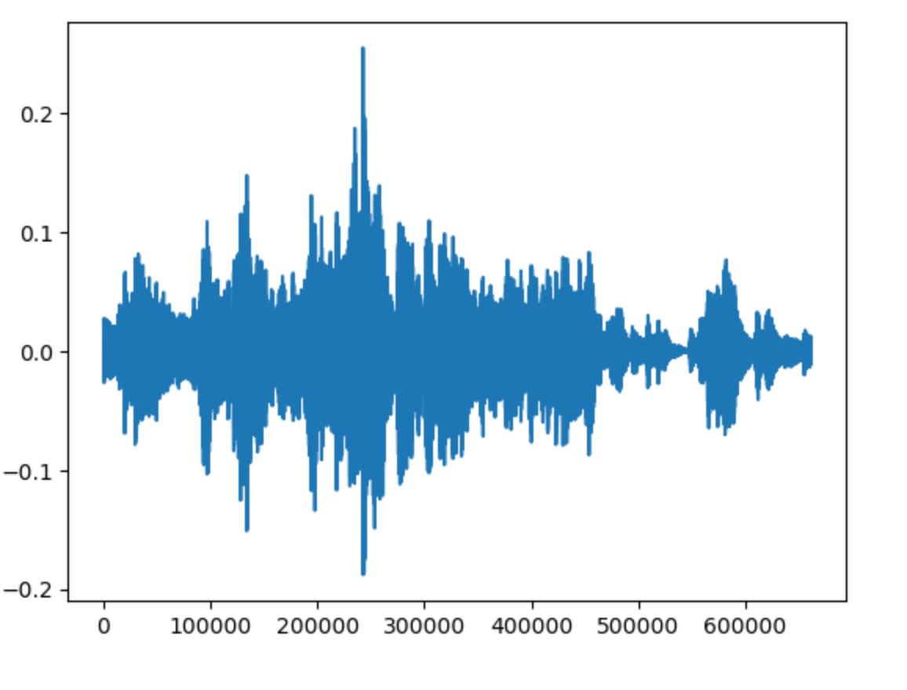
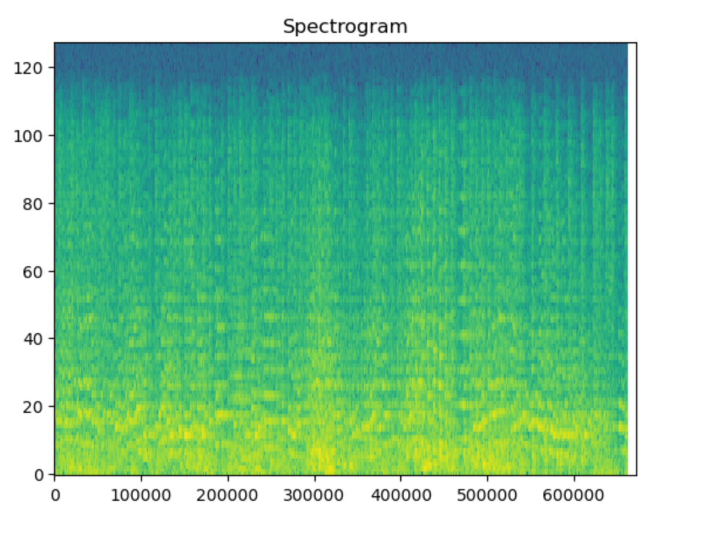
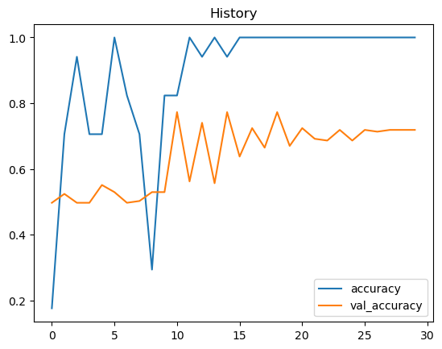
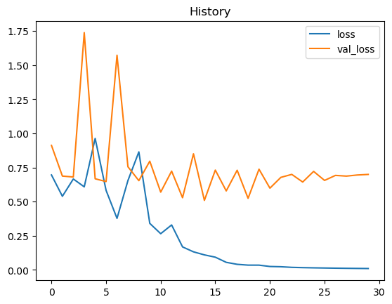

# Music-Genre-Classifier
Classifies song clip as classical or rock using CNN

## Overview

This project classified songs as either rock or classical based purely on 30 second audio clips. To achieve this, each audio clip was converted into an image called a spectrogram. The below graph is how audio clips are normally represented.

The following image shows the graph above converted into a spectrogram, which is a gray-scale image.

A convolutional neural network was trained on these images and achieved 71 accuracy on the test audio.

## Results

